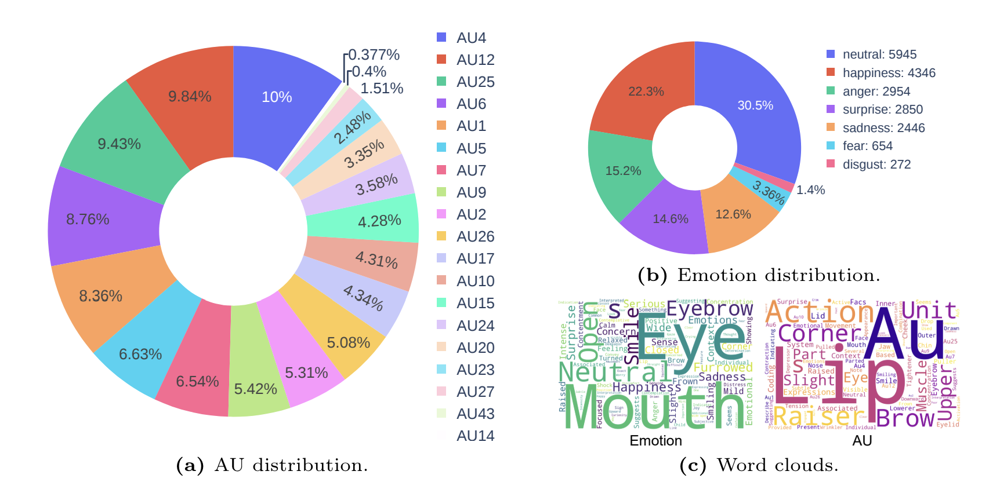
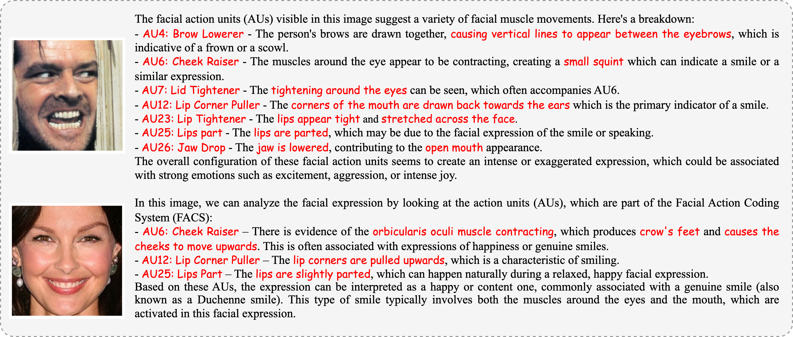
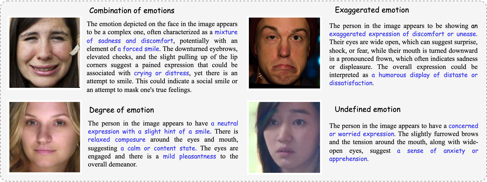

# Facial Affective Behavior Analysis with Instruction Tuning
[[Project Page](https://johnx69.github.io/FABA/)]  [[Data](https://drive.google.com/file/d/1DiKYcakkY3cmNSMvydLgeI4xWMwTsX77/view?pli=1)] [[Paper](https://arxiv.org/pdf/2404.05052)] [[Checkpoints-AU](https://drive.google.com/drive/folders/1oilow8lr25VD4BjVl3CMQQqvzD2_rgXC?usp=share_link)] [[Checkpoints-Emotion](https://drive.google.com/drive/folders/1co1KeE7cKdhp-AmRKZEDxWg0zVtmg66Y?usp=share_link)]

**Facial Affective Behavior Analysis with Visual Instruction Tuning** (ECCV 2024) [[Paper](https://arxiv.org/pdf/2404.05052)] <br>
[Yifan Li](https://jackyfl.github.io), [Anh Dao](https://scholar.google.com/citations?user=EOD0QkMAAAAJ&hl=zh-CN), [Wentao Bao](https://cogito2012.github.io/homepage/), [Zhen Tan](https://zhen-tan-dmml.github.io), [Tianlong Chen](https://tianlong-chen.github.io/), [Huan Liu](https://www.public.asu.edu/~huanliu/), [Yu Kong](https://www.egr.msu.edu/~yukong/)

<p align="center">
    <a href="https://johnx69.github.io/FABA/"></a> <br>
</p>

## Abstract
Facial affective behavior analysis (FABA) is crucial for understanding human mental states from images. However, traditional approaches primarily deploy models to discriminate among discrete emotion categories, and lack the fine granularity and reasoning capability for complex facial behaviors. The advent of Multi-modal Large Language Models (MLLMs) has been proven successful in general visual understanding tasks. However, directly harnessing MLLMs for FABA is challenging due to the scarcity of datasets and benchmarks, neglecting facial prior knowledge, and low training efficiency. To address these challenges, we introduce (i) an instruction-following dataset for two FABA tasks, i.e., facial emotion and action unit recognition, (ii) a benchmark FABA-Bench with a new metric considering both recognition and generation ability, and (iii) a new MLLM EmoLA as a strong baseline to the community. Our initiative on the dataset and benchmarks reveal the nature and rationale of facial affective behaviors, i.e., finegrained facial movement, interpretability, and reasoning. Moreover, to build an effective and efficient FABA MLLM, we introduce a facial prior expert module with face structure knowledge and a low-rank adaptation module into pre-trained MLLM. We conduct extensive experiments on FABA-Bench and four commonly-used FABA datasets. The results demonstrate that the proposed facial prior expert can boost the performance and EmoLA achieves the best results on our FABA-Bench. On commonly-used FABA datasets, EmoLA is competitive rivaling taskspecific state-of-the-art models.

## Contents
- [Installation](#installation)
- [Download](#downloading)
- [Dataset](#dataset)
- [Training ](#training)
- [Evaluation](#evaluation)
## Installation
You can install all the libraries by executing the bash file
```Shell
bash install.sh
```

The installed libraries include main packages
```Shell
conda create -n emola python=3.10 -y
conda activate emola
pip install --upgrade pip  # enable PEP 660 support
pip install -e .
```

and extra libraries
```Shell
pip install flash-attn --no-build-isolation
pip install wandb==0.15.12
pip install deepspeed==0.12.6
pip install rouge
pip install ipdb
```

## Downloading

After that, the pretrained **LLaVA-1.5-7b** ([link](https://huggingface.co/liuhaotian/llava-v1.5-7b/tree/main)) is required to be downloaded under the ```./checkpoints/``` directory.

The **FABAInstruct** ([link](https://arxiv.org/pdf/2404.05052)) dataset is required to be downloaded and unzip under the ```./data/``` directory. Note that the landmark features have already been extracted by the pretrained Insightface model and put into the FABAInstruct dataset. The preprocessing codes are in ```.feature_extraction/landmark```. The overall directory tree of FABA-Instruct dataset is like:
```
data/
└── FABAInstruct/
    ├── train/
    │   ├── train_au_anno.json
    │   ├── train_emotion_anno.json
    │   ├── images/
    │   └── landmarks/
    └── eval/
        ├── eval_au_anno.json
        ├── eval_emotion_anno.json
        ├── images/
        └── landmarks/
```

## Dataset
The statistics of the FABA-Instruct dataset is given by:
| **Statistics**                            | **Value** |
| ----------------------------------------- | --------- |
| Total images                              | 19877     |
| Emotion training samples                  | 19474     |
| Emotion testing samples                   | 403       |
| Emotion description average length        | 50.47     |
| AU training samples                       | 15838     |
| AU testing samples                        | 325       |
| AU description average length             | 207.35    |
<p align="center">
    <a href="https://johnx69.github.io/FABA/"></a> <br>
</p>

The ennotation include several keys, which are given as:
```json
{
    "source": "the dataset",
    "image": "the relative path of each image",
    "id": "the name of each image",
    "conversation": "the question and answer pair",
    "landmark": "the relative path of the landmark feature"
},
```

The annotation demo of FABAInstruct-AU is:
```json
  {
    "source": "AffectNet",
    "image": "FABAInstruct/train/images/AffectNet/AffectNet_v2/1194/4dfc35e0be3712362e8795bf27fe332cbd809e08a19340d935d4ec51.jpg",
    "id": "AffectNet/AffectNet_v2/1194/4dfc35e0be3712362e8795bf27fe332cbd809e08a19340d935d4ec51",
    "conversations": [
      {
        "from": "human",
        "value": "In this face, what are the discernible action units?\n<image>"
      },
      {
        "from": "gpt",
        "value": "This image depicts a person displaying a range of facial muscle movements that align with specific Facial Action Coding System (FACS) action units (AUs). Here are the AUs that appear to be in play based on the facial expression:\n\n1. AU4 - Brow Lowerer: The eyebrows are drawn together and downward, which usually indicates a frown or a scowl.\n2. AU9 - Nose Wrinkler: The wrinkles on the nose suggest that the nose wrinkler muscle is engaged.\n3. AU15 - Lip Corner Depressor: The corners of the lips are pulled down, which could suggest sadness or disgust.\n4. AU17 - Chin Raiser: The chin appears to be pushed upward, creating a wrinkled or pouted appearance on the lower face.\n\nPlease note that interpreting AUs and the corresponding emotions can be subjective, and the context of the facial expression and other nonverbal cues are important for accurate interpretation."
      }
    ],
    "landmark": "FABAInstruct/train/landmarks/AffectNet/AffectNet_v2/1194/4dfc35e0be3712362e8795bf27fe332cbd809e08a19340d935d4ec51.npy"
  },
```
The demo annotation for FABA-Instruct-Emotion is:
```json
  {
    "source": "AffectNet",
    "image": "FABAInstruct/train/images/AffectNet/AffectNet_v2/916/93ebd6d360782d3d42c0a7b381c120764baaa9f23c8c9c42062f1599.jpg",
    "id": "AffectNet/AffectNet_v2/916/93ebd6d360782d3d42c0a7b381c120764baaa9f23c8c9c42062f1599",
    "conversations": [
      {
        "from": "human",
        "value": "What is the emotion of this face?\n<image>"
      },
      {
        "from": "gpt",
        "value": "The person in the image appears to have a gentle expression. There is a softness in their eyes, and the mouth is neither turned downward nor upward significantly, which could be interpreted as a neutral or emotional calmness. The eyes also seem a bit reflective or thoughtful. Without full context, it is difficult to pinpoint the exact emotion, but there does not appear to be an overt display of strong emotions such as joy, sadness, anger, or surprise."
      }
    ],
    "landmark": "FABAInstruct/train/landmarks/AffectNet/AffectNet_v2/916/93ebd6d360782d3d42c0a7b381c120764baaa9f23c8c9c42062f1599.npy"
  },
```
The illustration of FABA-Instruct-AU:
<p align="center">
    <a href="https://johnx69.github.io/FABA/"></a> <br>
</p>
The illustration of FABA-Instruct-Emotion:
<p align="center">
    <a href="https://johnx69.github.io/FABA/"></a> <br>
</p>


## Training

Training EmoLA
```Shell
# AU task
bash scripts/train_emola/train_emola_au.sh 
# Emotion task
bash scripts/train_emola/train_emola_emotion.sh
```

## Evaluation

Testing EmoLA
```Shell
# AU task
bash scripts/infer_emola/infer_emola_au.sh
# Emotion task
bash scripts/infer_emola/infer_emola_emotion.sh
```

The results for FABAInstruct-AU should be close to:
|**$S_{re}$**|**$S_{ge}$**|**$S_{rege}$**|
|----|----|----|
|56.3|35.2|91.5|

The results for FABAInstruct-emotion should be close to:
|**$S_{re}$**|**$S_{ge}$**|**$S_{rege}$**|
|----|----|----|
|64.5|31.7|96.2|

You can refer to the ```./output_test/``` directory for the generation results. 

## Citation
If you find our FABA-Instruct or EmoLA useful for your research, please cite using the following BibTeX:

```bibtex
@article{li2024facial,
  title={Facial Affective Behavior Analysis with Instruction Tuning},
  author={Li, Yifan and Dao, Anh and Bao, Wentao and Tan, Zhen and Chen, Tianlong and Liu, Huan and Kong, Yu},
  journal={arXiv preprint arXiv:2404.05052},
  year={2024}
}
```

## Acknowledgement
The images in FABA-Instruct are from [AffectNet](http://mohammadmahoor.com/affectnet/), and our codebase is based on [LLaVA](https://github.com/haotian-liu/LLaVA). Thanks for these great projects!

## NSF Acknowledgement
This material is based upon work supported by the National Science Foundation (NSF) under Grant No. 1949694 and 2040209. Any opinions, findings, and conclusions or recommendations expressed in this material are those of the author(s) and do not necessarily reflect the views of the National Science Foundation.
